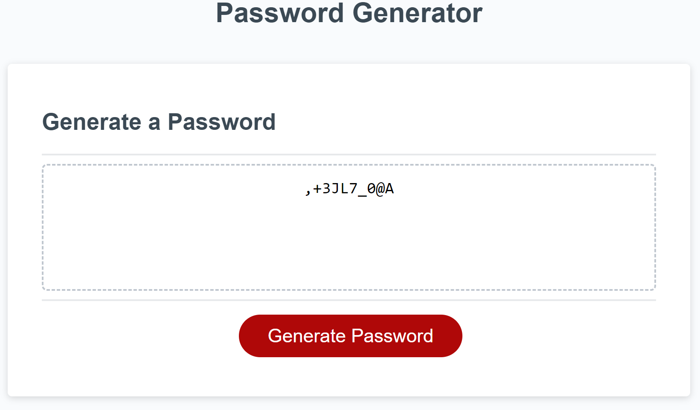

# Unique-password-generator

## Description

The motivation is to generate a password as unique as possible and somewhat easy to remember! I built this application that a person can use to generate a random password based on criteria they have selected!
I learned that such an application could be useful, and from the coding point of view that there are several ways to code in javascript when you want to express an action.

## Installation

Running the Code:
    Open the index.html file in a web browser.
    Open the browser's developer console (usually opening it in Google Chrome).
    The random password results will be displayed in the console. My example: 
    https://andreea-lita.github.io/Unique-password-generator/

What are the steps required to install your project? Provide a step-by-step description of how to get the development environment running.

## Usage

Provide instructions and examples for use. Include screenshots as needed.
In JavaScript I wrote a function to prompt us password options:

Then the part that generates step by step the password array, taking in account what options were passed:

## Credits

https://www.hackinbits.com/articles/js/push-pop-shift-and-unshift-array-methods-in-javascript
https://www.freecodecamp.org/news/var-let-and-const-whats-the-difference/ 

List your collaborators, if any, with links to their GitHub profiles.

If you used any third-party assets that require attribution, list the creators with links to their primary web presence in this section.

If you followed tutorials, include links to those here as well.

## License
MIT Licensed

## Features

If your project has a lot of features, list them here.

## How to Contribute

If you created an application or package and would like other developers to contribute it, you can include guidelines for how to do so.

## Tests
Finaly a screenshoot with the password generated example: 

Nevertheless, if you want to include the special characters array in your test results, you can use the following commands to add it:

Go the extra mile and write tests for your application as well. Then provide examples on how to run them here.